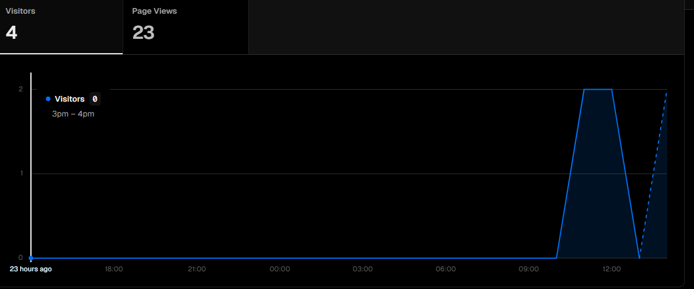
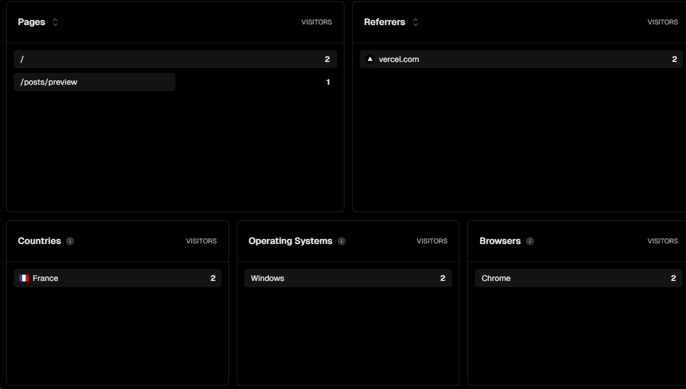
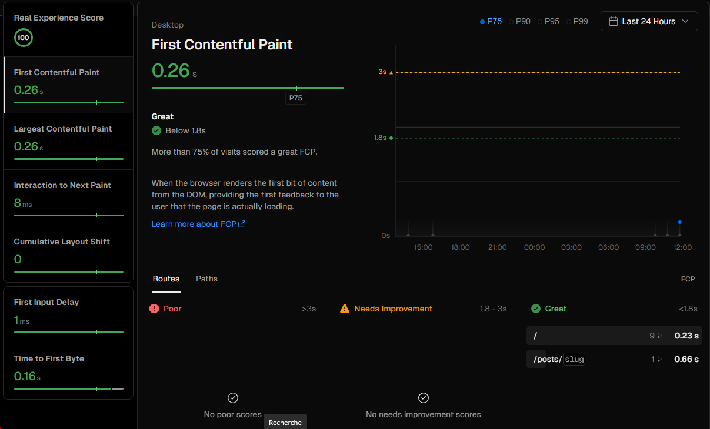

# Projet DevOps

## Description du projet

Ceci est un projet de DevOps.
L'objectif est notamment d'étudier la mise en place d'une intégration et d'un déploiement continu.
Dans ce but, nous avons opté pour le faire de clôner une simple template Next.js, afin de pouvoir la déployer aisément sur Vercel.

Il s'agit d'onc d'une app essentiellement Front-End utilisant le framework Next.js, et déployée statiquement grâce à Vercel sur l'URL suivant :
https://project-devops.vercel.app


## Monitoring 

### Web Analytics Vercel
Après avoir publié notre site à l'aide de vercel, il est possible d'obtenir des informations détaillées sur les visites du site web.
Vercel analystics permet de fournir des informations sur les pages visitées, le nombre de visiteurs, les navigateurs, la localisation des visiteurs...

Vercel met a disposition des dashboards avec toutes les informations concernant les statistiques de notre site.
Ces fonctions sont disponibles avec la version gratuite de vercel, d'avantages de dashboards sont disponible avec un compte pro.

Afin d'intégrer cela au projet, il suffit d'importer le package vercel associé à cette fonctionnalité.
 
```
npm i @vercel/analytics
```

Une fois le package téléchargé sur notre projet, il suffit de l'importer dans notre site (Layout.tsx dans notre cas)

Intégration dans notre projet: 

https://github.com/LukaLai/ProjectDevops/pull/17




#### Speed Insights Vercel

Toujours dans le monitoring de notre site, il est possible d'avoir egalement des statistiques de vitesse d'execution et de chargement de notre site disponible directement a partir de vercel.
De la meme facon, il suffit d'installer le package associé avec 
```
npm i @vercel/speed-insights
```
Ensuite l'integrer dans notre projet
https://github.com/LukaLai/ProjectDevops/pull/20



#### Grafana

Grafana est un outil open source de monitoring flexible qui permet de se connecter à des technos différente. 
Le framework analytics de vercel permet une intégration native, ce qui simplifie le processus de configuration et de visualisation des données.
Sans utiliser Grafana dans notre projet, l'outil semble beaucoup plus complet en termes d'informations et de tableaux de bord.